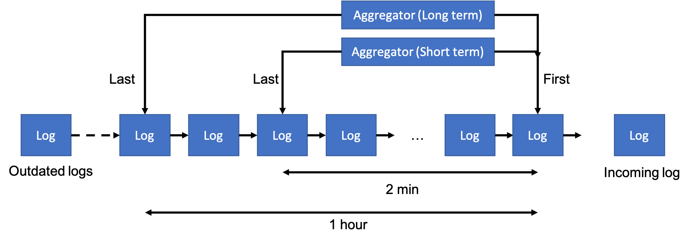

# Suricata
## Website monitor
Developed by Simon Brandeis

## Starting the software

### Prerequisites
Go must be installed to build the project [golang.org](https://golang.org/dl/).

### Execution instructions
``go build`` to build the executable, then just execute the file "suricata"

You can also execute the bash script `build_start` to build and launch "suricata".

The app has been compiled in a few OSes and Architectures. See /bin folder.

### Configuration
The websites to monitor and the check intervals are defined in a config file.

By default, "suricata" uses `config.sample`, but you can specify your own file by passing its path to the flag `cfg`.

*Ex*: `./suricata -cfg="/your/config/file"`

Config file format:

```
www.google.com,300
https://github.com,500
```

This config file sets suricata to monitor google.com and github.com
with a check interval of respectively 300 and 500 milliseconds

## Documentation

### Folder structure

```
|-main.go
| config.sample
|-suricata
|-README.md
|-bin
|  |-build_start
|-cui
|  |-Ui.go
|-monitor
|  |-Aggregator_test.go
|  |-MaxHeap.go
|  |-Aggregator.go
|  |-MaxHeap_test.go
|  |-Pinger.go
|  |-Orchestrator.go
|  |-Orchestrator_test.go
|  |-Alert.go
|  |-Report.go
|  |-Website.go
```

"suricata" is composed of two modules:
- `suricata/monitor`  which monitors the websites
- `suricata/cui` which abstracts UI updating.

"suricata" has 1 external dependency: [termui](https://github.com/gizak/termui).


### Functional Overview

Website monitoring is centralized by the singleton object `Orchestrator`.

`Orchestrator` registers websites (i.e, urls and check intervals) and controls
the `Pinger` objects, which perform the HTTP requests.

`Pinger` objects perform requests in parallel, and send data about the response in a shared channel (`pipeline` in `main.go`).
This data is represented by a `PingLog` object.

When data is sent to the pipeline, `Orchestrator` forwards it to the appropriate
`Aggregator` objects.

`Aggregator` objects peform on-the-fly metrics computing. To do so, `PingLog` are stored
in a queue, and `Aggregator` holds a reference to the first and last elements of this queue.

Aggregators.png illustrates the data structure.



Metrics computing is done when aggregating (queueing) or de-aggregating (dequeueing)
a `PingLog`. Queueing and dequeueing have a O(1) complexity.

Plus, `Aggregator` holds a reference to each element of the queue in a `MaxHeap` attribute, backed by an array.
Each element of the queue holds its index in this array. Elements are ordered by their `ResponseTime` attribute.

This allows to insert and delete elements in the heap in O(ln(n)), where n is the number of elements in the heap.
Must importantly, this data structure allows maximum element retrieval in O(1) time complexity.

Eventually, processing the incoming `PingLog`s is done in O(ln(n)) time complexity, where n is the number of elements in the heap, and yields average and maximum values on the data processed.

Metrics on aggregated logs are regularily read to update `Report` objects, in which metrics are stored.
Reports are transformed into `Summary`, used by the the `suricata/cui` package to generate a `termui.Table` components to display on screen.

During the process, `Alert`s objects are emitted on the `alert` channel, transporting either messages or serious alerts (eg, when a website's availability drops under 80%).


## Possible Improvements

For the same website, all associated `Aggregator`s objects hold the reference to the latest `PingLog`. It would be better to have them share this reference: it's less bug-prone and slightly more efficient.

The combination of a Max Heap and a Linked List seems a bit clumsy, it feels like we store twice too much data.

If computing the maximum response time is not needed, dropping the heap improves significantly the performance: insertion and deletion of `PingLog`s is in O(1) time complexity.

This tool is designed to be running indefinitely, it should have a logging system to store alerts and measures somewhere on the file system: we can't just spend the day staring at it.

Test coverage is only of 49 %. TDD could have been useful to highlight bugs earlier.

`Orchestrator.go` is a quite long file (~340 lines), which affects readability . Perhaps it could be splitted in smaller files.

